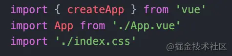
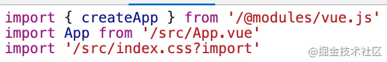
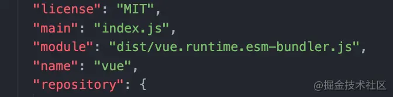

一、 vite 介绍

1. vite 是一个开发构建工具, 开发过程中它利用浏览器(native ES Module)[https://caniuse.com/es6-module-dynamic-import]特性导入组织代码, 生产中利用 rollup 作为打包工具

2. 特点如下

   - 光速启动
   - 热模块替换
   - 按需编译

3. 浏览器支持

   - 开发环境: vite 需要在支持(原生 ES 模块动态导入)[https://caniuse.com/es6-module-dynamic-import]的浏览器中使用
   - 生产环境: 默认支持的浏览器需要支持 通过[脚本标签来引入原生 ES 模块](https://caniuse.com/es6-module) 。可以通过官方插件[@vitejs/plugin-legacy](https://github.com/vitejs/vite/tree/main/packages/plugin-legacy)支持旧浏览器。

二、搭建 vite 项目

> 兼容性注意: vite 需要 NodeJS 版本 >= 12.0.0

1. 使用 npm

```shell
npm init @vitejs/app
```

2. 使用 yarn

```shell
yarn create @vitejs/app
```

3. 通过附加命令行直接指定项目名称和想要使用的模板

```shell
# npm 6.x
npm init @vitejs/app my-vue-app --template vue

# npm 7+, 需要额外的双横线
npm init @vitejs/app my-vue-app -- --template vue

# yarn
yarn create @vitejs/app my-vue-app --template vue
```

三、 index.html 与 项目根目录

1. index.html 在项目最外层而不是在 public 文件夹内的原因

   在开发期间 vite 是一个服务器, 而 index.html 是该 vite 项目的入口文件

2. vite 将 index.html 视为源码和模块图的一部分

   - vite 解析`<script type="module" src="..."> `指向 JavaScript 源码
   - 内联引入 JavaScript 的 `<script type="module" src="...">` 和引用 CSS 的`<link href>`也能利用 Vite 特有的功能被解析
   - index.html 中的 URL 将被自动转换，因此不再需要 %PUBLIC_URL% 占位符了。

3. 与静态 HTTP 服务器类似，Vite 也有 “根目录” 的概念，即文件被提供的位置

   - 源码中的绝对 URL 路径将以项目的 “根” 作为基础来解析，因此你可以像在普通的静态文件服务器上一样编写代码
   - Vite 还能够处理依赖关系，解析处于根目录外的文件位置，这使得它即使在基于 monorepo 的方案中也十分有用。

4. Vite 也支持多个 .html 作入口点的[多页面应用模式](https://vitejs.cn/guide/build.html#%E5%A4%9A%E9%A1%B5%E9%9D%A2%E5%BA%94%E7%94%A8%E6%A8%A1%E5%BC%8F)

四、 命令行界面

1. 在 npm scripts 中使用 vite 可执行文件

```json
{
  "scripts": {
    "dev": "vite", // 启动开发服务器
    "build": "vite build", // 为生产环境构建产物
    "serve": "vite preview" // 本地浏览生产构建产物
  }
}
```

2. 直接使用`npx vite` 运行

3. 可以指定额外的命令行选项: --port 或者 --https, 运行 `npx vite --help`获得完整的命令行选项列表

五、代码组织形式分析

1. 关键变化是`index.html`中的入口文件导入方式


2. 这样`main.js`就可以使用 ES6 Module 方式组织代码



3. 浏览器会自动加载这些导入, vite 会启动一个本地服务器处理这些不同加载请求. 对于相对地址的导入, 要根据后缀名处理文件内容并返回, 对于裸模块导入要修改它的路径为相对地址并在此请求处理



4. 在根据模块 package.json 中的入口文件选项获取要加载的文件。



六、 资源加载方式解析

1. 直接导入 css 文件

vite 中可以直接导入`.css`文件, 样式将影响导入的页面, 最终会被打包到 style.css

> 在我们程序中，除了全局样式大部分样式都是以形式存在于 SFC 中

```js
import { createApp } from 'vue';
import App from './App.vue';

import './index.css';
```

2. Scoped CSS

```css
<style scoped>
/***/
</style>
```

3. CSS Module: SFC 中使用 CSS Module

任何以 .module.css 为后缀名的 CSS 文件都被认为是一个 CSS modules 文件。导入这样的文件会返回一个相应的模块对象

```html
<style module>
  /***/
</style>
```

```css
/* example.module.css */
.red {
  color: red;
}
```

CSS modules 行为可以通过 [css.modules 选项](https://vitejs.cn/config/#css-modules)进行配置

如果 css.modules.localsConvention 设置开启了 camelCase 格式变量名转换（例如 localsConvention: 'camelCaseOnly'）， 你还可以使用按名导入。

```js
// .apply-color -> applyColor
import { applyColor } from './example.module.css';
document.getElementById('foo').className = applyColor;
```

> 请注意 CSS modules localsConvention 默认是 camelCaseOnly - 例如一个名为 .foo-bar 的类会被暴露为 classes.fooBar

举个例子: 修改组件样式为 CSS Module 形式

```css
<style module>
.message-box {
   padding: 10px 20px;
   background: #ff0;
   border: 1px solid #42b;
   color: #fff;
}
.message-box-close {
   float: right;
   cursor: pointer;
}
</style>
```

```html
<div :class="$style.messageBox">
  <h3>
    <!-- 具名插槽 -->
    <slot name="title"/>
    <span :class="$style.messageBoxClose" @click="$emit('close')">
  </h3>
</div>
```

js 中导入 CSS Module: 将 css 文件命名为`*.module.css`即可

```js
import style from './Message.module.css';

export default {
  emits: ['close'],
  computed: {
    $style() {
      return style;
    },
  },
};
```

4. css 预处理器

- 安装对应的预处理器就可以直接在 vite 项目中使用

```shell
# .scss and .sass
npm install -D sass

# .less
npm install -D less

# .styl and .stylus
npm install -D stylus
```

```html
<style lang="scss">
  /*use scss */
</style>
```

- 在 js 中导入

```js
import './style.scss';
```

- 通过在文件扩展名前加上 .module 来结合使用 CSS modules 和预处理器，例如 style.module.scss

5. PostCSS

vite 自动对`*.vue`文件和导入`.css`文件应用 PostCSS 配置, 我们只需要安装必要的插件合添加[`postcss.config.js`](https://github.com/postcss/postcss-load-config)文件即可

```js
module.exports = {
  plugins: [require('autoprefixer')],
};
```

```shell
npm i postcss autoprefixer@8.1.4
```

6. 资源 URL 处理

相关文档: [公共基础路径](https://vitejs.cn/guide/build.html)、[assetsInclude](https://vitejs.cn/config/#assetsinclude)

- 引用静态资源

可以在`*.vue`文件的 template、style 和 css 文件中以相对和绝对路径引用静态资源

```html
<!-- 相对路径 -->

<!-- 绝对路径 -->

<!-- style标签 -->
<style scoped>
  #app {
    background-image: url('./assets/logo.png');
  }
</style>
```

- public 目录

public 目录下可以存放围在源码中引用的资源, 他们就会被留下且文件名不会被哈希处理

这些文件会被原封不动拷贝到发布目录的根目录下

```html

```

> 注意引用位置在 public 下的文件需要使用绝对路径, 例如 public/icon.png 应该使用/icon.png
> public 中的资源不应该被 JavaScript 文件引用。

- URL 导入

导入一个静态资源会返回解析后的 URL

```js
import imgUrl from './img.png';
document.getElementById('img').src = imgUrl;
```

添加一些特殊的查询参数可以更资源被引入的方式

```js
// 显式加载资源为URL
import assetAsURL from './asst.js?url';

// 以字符串形式加载资源
import assetAsString from './shader.glsl?raw';

// 加载为Web Worker
import Worker from './worker.js?worker';

// 在构建时 Web Worker 内联为 base64 字符串
import InlineWorker from './worker.js?worker&inline';
```

七、 typescript

vite 支持开箱即用地引入 .ts 文件

Vite 仅执行 .ts 文件的翻译工作，并 不 执行任何类型检查。并假设类型检查已经被你的 IDE 或构建过程接管了。（你可以在构建脚本中运行 tsc --noEmit 或者安装 vue-tsc 然后运行 vue-tsc --noEmit 来对你的 \*.vue 文件做类型检查）。

Vite 使用 [esbuild](https://github.com/evanw/esbuild) 将 TypeScript 翻译到 JavaScript，约是 tsc 速度的 20~30 倍，同时 HMR 更新反映到浏览器的时间小于 50ms。

> 注意因为 esbuild 只执行转译工作而不含类型信息，所以它无需支持 TypeScript 的特定功能例如常量枚举和隐式 “type-only” 导入。你必须在你的 tsconfig.json 中的 compilerOptions 里设置 "isolatedModules": true，这样 TS 才会警告你哪些功能无法与独立编译模式一同工作。


八、 缓存

1. 文件系统缓存

vite 会将预构建的依赖缓存到`node_modules/.vite`。它会根据几个源来决定是否需要重新运行预构建步骤:

- package.json 中的 dependencies 列表
- 包管理器的 lockfile, 例如 package-lock.json、 yarn.lock、pnpm.lock.yaml
- 可能在 vite.config.js 相关字段中配置过

只有当上面一个步骤发生变时, 才需要重新运行优构建步骤

如果出于某些原因, 想要强制 vite 重新绑定依赖, 可以使用

- `--force`命令行选项启动开发服务器
- 手动删除`node_modules/.vite`目录

2. 浏览器缓存

Vite 通过 HTTP 头来缓存请求得到的依赖。

解析后的依赖请求会以 HTTP 头`max-age=31536000,immutable`强缓存, 以提高在开发时的页面重载性能。一旦被缓存, 这些请求将永远不会再到达开发服务器。

如果安装了不同的版本(这反映在包管理器的 lockfile 中), 则附加的版本 query 会自动使他们失效。

如果你想通过本地编辑来调试依赖项目可以通过

- 浏览器 devtools 的 network 选项卡暂时禁用缓存
- 重启 vite dev server, 使用--force 标志重新打包依赖
- 重新载入页面

八、 NPM 依赖项解析和预构建

1. 原生 ES 引入不支持下面这种裸模块导入

```js
import { method } from 'dep';
```

上面的操作将在浏览器中抛出一个错误。Vite 将在服务的所有源文件中检测此类裸模块导入，并执行以下操作:

- 预构建他们以提升页面重载速度, 并将 CommonJS/UMD 转换为 ESM 格式。预构建这一步由 esbuild 执行，这使得 Vite 的冷启动时间比任何基于 javascript 的打包程序都要快得多。

- 重写导入为合法的 URL，例如 /node_modules/.vite/my-dep.js?v=f3sf2ebd 以便浏览器能够正确导入它们。

2. 依赖预构建的原因

- CommonJS 和 UMD 兼容性

  开发阶段中，Vite 的开发服务器将所有代码视为原生 ES 模块。因此，Vite 必须先将作为 CommonJS 或 UMD 发布的依赖项转换为 ESM。

  当转换 CommonJS 依赖时，Vite 会执行智能导入分析，这样即使导出是动态分配的（如 React），按名导入也会符合预期效果

- 性能

  vite 将有许多内部模块的 ESM 依赖关系转换为单个模块, 以提高后续页面加载性能

  一些包将它们的 ES 模块构建作为许多单独的文件相互导入。 例如，lodash-es 有超过 600 个内置模块！当我们执行 import { debounce } from 'lodash-es' 时，浏览器同时发出 600 多个 HTTP 请求！尽管服务器在处理这些请求时没有问题，但大量的请求会在浏览器端造成网络拥塞，导致页面的加载速度相当慢。

  通过预构建 lodash-es 成为一个模块，我们就只需要一个 HTTP 请求了！

3. 自动依赖搜寻

   如果没有找到存在的缓存，Vite 将抓取你的源码，并自动发现依赖项导入（即 "裸引入"，期望从 node_modules 解析），并使用这些发现的导入作为预构建包的入口点。预绑定是用 esbuild 执行的，所以它通常非常快。

   在服务器已经启动之后，如果在缓存中没有遇到新的依赖项导入，Vite 将重新运行依赖构建进程并重新加载页面。

4. 模块热重载

Vite 提供了一套原生 ESM 的 [HMR API](https://vitejs.cn/guide/api-hmr.html#hot-accept-deps-cb)。 具有 HMR 功能的框架可以利用该 API 提供即时、准确的更新，而无需重新加载页面或删除应用程序状态。Vite 提供了第一优先级的 HMR 集成给 Vue 单文件组件（SFC） 和 React Fast Refresh。也有对 Preact 的集成 @prefresh/vite。
